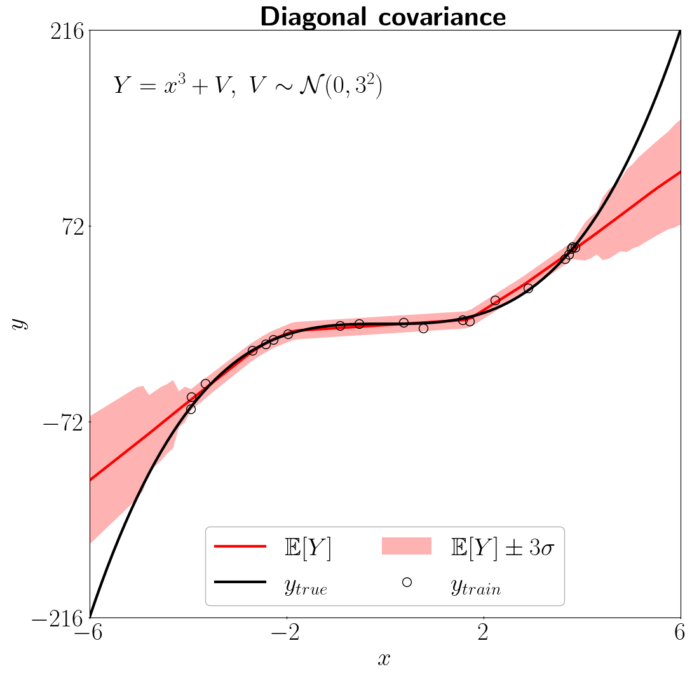
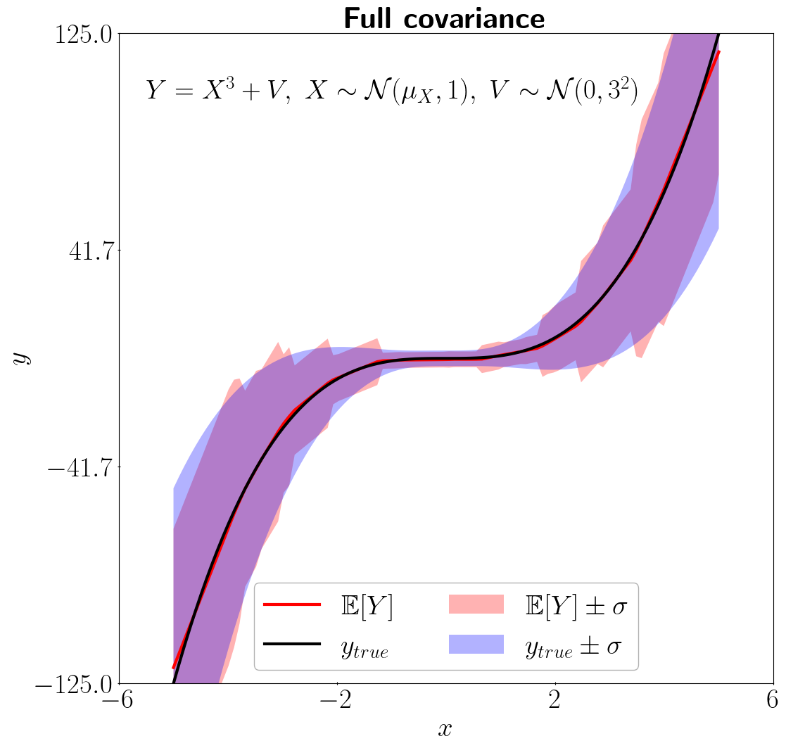
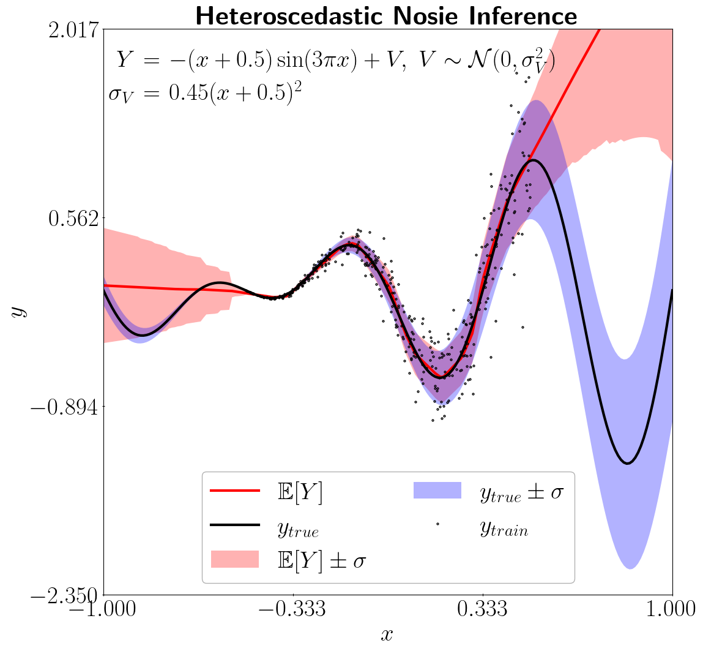
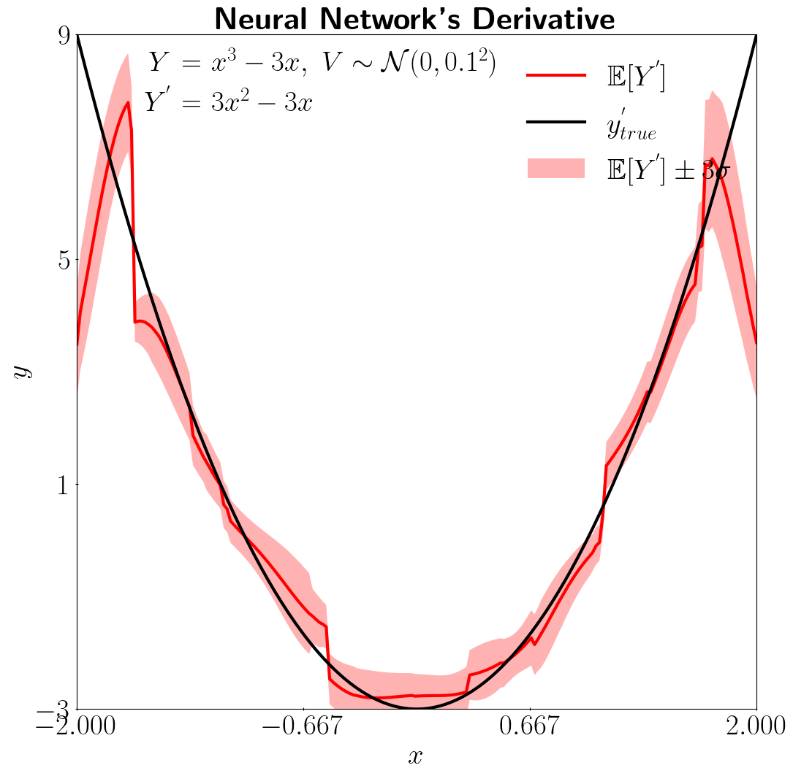

<p align="center">
  
</p>

#### [Examples](#examples) | [License](#license) | [Related Papers](#related-papers) | [Citation](#citation)

cuTAGI is a probabilistic array framework  built upon the principles of the Tractable Approximate Gaussian Inference (TAGI) theory. It focuses on quantifying the uncertainty in Deep Neural Networks (DNNs), directly improving their reliability across supervised, unsupervised, and reinforcement learning tasks.

Some key features of cuTAGI include:
- **Performance-Oriented Kernels**: All kernels of DNN layers are written in C++/CUDA from the scratch, with the utilization of pybind11 for seamless Python integration. It allows running on CPU and CUDA devices through Python API.
- **Broad Architecture Support**: It currently supports the basic layer of DNNs including Linear, CNNs, Transposed CNNs, LSTM, Average Pooling,  normalization, enabling the building of mainstream architectures such as Autoencoders, Transformers, Diffusion Models, and GANs.
- **Model Building and Execution**: Currently, it supports sequential model building, with plans to introduce Eager Execution in the future for better debugging
- **Open Platform**: cuTAGI provides open access to its entire codebase. This transparency and accessibility allows researchers and developers to dive deep into the cuTAGI's core functionalities.

cuTAGI targets machine learning researchers and developers, aiming to improve the reliability of neural network outcomes, learning efficiency, and adaptability to different dataset sizes. The Python API, inspired by the PyTorch framework, is designed to quickly onboard researchers for idea exploration.


Examples of regression task using the diagonal (top left) or full (top right) covariance modes for hidden layers, an example of heteroscedastic aleatory uncertainty inferrence (bottom left), and an example for the estimation of the derivative of a function modeled by a neural network (bottom right).
<p align="center">
  &emsp;&emsp;&emsp;&emsp;&emsp;&emsp;
</p>


##  Examples
Here is an example for training a classifer using pytagi on MNIST dataset
```Python
from pytagi.nn import Linear, OutputUpdater, ReLU, Sequential
from pytagi import Utils, HRCSoftmaxMetric
from examples.data_loader import MnistDataloader

batch_size = 20
dtl = MnistDataLoader()
metric = HRCSoftmaxMetric(num_classes=10)

net = Sequential(
    Linear(784, 100),
    ReLU(),
    Linear(100, 100),
    ReLU(),
    Linear(100, 11),
)
#net.to_device("cuda")

udt = OutputUpdater(net.device)
var_y = np.full((batch_size * 4,), 1.0, dtype=np.float32)

batch_iter = dtl.create_data_loader(batch_size)

for i, (x, y, idx, label) in enumerate(batch_iter):
  m_pred, v_pred = net(x)
  # Update output layer based on targets
  udt.update_using_indices(net.output_z_buffer, y, var_y, idx, net.input_delta_z_buffer)
  net.backward()
  net.step()
  error_rate = metric.error_rate(m_pred, v_pred, label)
  print(f"Iteration: {i} error rate: {error_rate}")

```
cuTAGI offers a diverse set of examples to demonstrate its capabilities, including:
- Regression
  ```shell
  python -m examples.regression
  ```
- Classification on MNIST using various layers such as Linear, CNNs, Batch & Layer Norms.
  ```shell
  python -m examples.classification
  ```
- Generation of MNIST images using an Autoencoder.
  ```shell
  python -m examples.autoencoder
  ```
- Time series forecasting
  ```shell
  python -m examples.time_series_forecasting
  ```

## Installation
cuTAGI is available on PyPI. To install, execute the following command in Terminal:

```shell
pip install pytagi
```
Additionally, for those interested in leveraging the full performance of the C++/CUDA native version, installation instructions are provided in the `docs/dev_guide.md`.

## License

cuTAGI is released under the MIT license.

**THIS IS AN OPEN SOURCE SOFTWARE FOR RESEARCH PURPOSES ONLY. THIS IS NOT A PRODUCT. NO WARRANTY EXPRESSED OR IMPLIED.**
## Related Papers

* [Analytically tractable hidden-states inference in Bayesian neural networks](https://www.jmlr.org/papers/volume23/21-0758/21-0758.pdf) (Luong-Ha Nguyen and James-A. Goulet. Journal-to-conference track, ICLR 2024.)
* [Analytically tractable heteroscedastic uncertainty quantification in Bayesian neural networks for regression tasks](http://profs.polymtl.ca/jagoulet/Site/Papers/Deka_TAGIV_2024_preprint.pdf) (Bhargob Deka, Luong-Ha Nguyen and James-A. Goulet. Neurocomputing, 2024)
* [Tractable approximate Gaussian inference for Bayesian neural networks](https://www.jmlr.org/papers/volume22/20-1009/20-1009.pdf) (James-A. Goulet, Luong-Ha Nguyen, and Said Amiri. JMLR, 2021)
* [Analytically tractable inference in deep neural networks](https://arxiv.org/pdf/2103.05461.pdf) (Luong-Ha Nguyen and James-A. Goulet. 2021)
* [Analytically tractable Bayesian deep Q-Learning](https://arxiv.org/pdf/2106.11086.pdf) (Luong-Ha Nguyen and James-A. Goulet. 2021)

## Citation

```
@misc{cutagi2022,
  Author = {Luong-Ha Nguyen and James-A. Goulet},
  Title = {cu{TAGI}: a {CUDA} library for {B}ayesian neural networks with Tractable Approximate {G}aussian Inference},
  Year = {2022},
  journal = {GitHub repository},
  howpublished = {https://github.com/lhnguyen102/cuTAGI}
}
```
