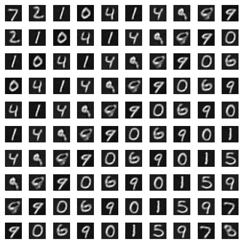

# Table of Contents
* [What is cuTAGI ?](#What-is-cuTAGI)
* [Python Installation](#pytagi-installation)
* [C++/CUDA Installation](#cutagi-installation)
* [Directory Structure](#directory-structure)
* [License](#license)
* [Related Papers](#related-papers)
* [Citation](#citation)

## What is cuTAGI ?
cuTAGI is an open-source Bayesian neural networks library that is based on Tractable Approximate Gaussian Inference (TAGI) theory. cuTAGI includes several of the common neural network layer architectures such as full-connected, convolutional, and transpose convolutional layers, as well as skip connections, pooling and normalization layers. cuTAGI is capable of performing different tasks such as supervised learning, unsupervised learning, and reinforcement learning. The library includes some of the advanced features such as the capacity to propagate uncertainties from the input to the output layer using the the [full covariance mode for hidden layers](https://www.jmlr.org/papers/volume22/20-1009/20-1009.pdf), the capacity to estimate the [derivative](https://www.jmlr.org/papers/volume23/21-0758/21-0758.pdf) of a neural network, and the capacity to quantify heteroscedastic aleatory uncertainty. 

cuTAGI is under development and new features will be added as they are ready. Currently supported tasks are:
* Supervised learning
  * Regression
  * Long Short-Term Memory (LSTM)
  * Classification using fully-connected, convolutional and residual architectures
* Unsupervised learning
  * Autoencoders
 
Coming soon...
* Unsupervised learning: GANs
* Reinforcement learning: DQN
* +++

Examples of [regression task](#regression-task) using the diagonal (top left) or full (top right) covariance modes for hidden layers, an example of heteroscedastic aleatory uncertainty inferrence (bottom left), and an example for the estimation of the derivative of a function modeled by a neural network (bottom right).
<p align="center">
  &emsp;&emsp;&emsp;&emsp;&emsp;&emsp;
</p>

## Prerequisites for Local Installation
* Compiler with C++14 support
* CMake>=3.23
* CUDA toolkit (optional)

## `pytagi` Installation 
`pytagi` is a Python wrapper of C++/CUDA backend for TAGI method. The developers can install either  [distributed](#pypi-installation) or [local](#local-installation) versions of `pytagi` 

### Create Miniconda Environment
We recommend installing miniconda for managing Python environment, yet `pytagi` works well with other alternatives.
1. Install miniconda by following these [instructions](https://docs.conda.io/projects/conda/en/latest/user-guide/install/index.html#system-requirements) 
2. Create a conda environment
    ```
    conda create --name your_env_name python=3.10
    ```
3. Install requirements
    ```
    conda activate your_env_name
    ```

### PyPI Installation
1. [Create conda environment](#create-conda-environment)
2. Install requirements
    ```
    pip install -r requirements.txt
    ```
3. Install `pytagi`
    ```
    pip install pytagi
    ```
NOTE: This PyPI distributed version does not require the codebase in this repository. The developers can create their own applications (see [python_examples](python_examples)).

### Local Installation
1. Clone this repository. Note that `git submodule` command allows cloning [pybind11](https://github.com/pybind/pybind11) which is the binding python package of C++/CUDA.
    ```
    git clone https://github.com/lhnguyen102/cuTAGI.git
    cd cuTAGI
    git submodule update --init --recursive
    ```
2. [Create conda environment](#create-conda-environment)
4. Install requirements
    ```
    pip install -r requirements.txt
    ```
5. Install `pytagi` package
    ```sh
    pip install .
    ```
6. Test `pytagi` package
    ```sh
    python -m python_examples.regression_runner
    ```

## `cutagi` Installation
`cutagi` is the native version implemented in C++/CUDA for TAGI method. We highly recommend installing cuTAGI using Docker method to facilitate the installation.


### Docker build
1. Install Docker by following these [instructions](https://docs.docker.com/get-docker/)
2. Build docker image
  * CPU build
      ```sh
      bash bin/build.sh
      ```
  * CUDA build 
      ```sh
      bash bin/build.sh -d cuda
      ```
*NOTE: During the build and run, make sure that Docker desktop application is opened. The commands for runing tasks such as classification and regression can be found [here](#docker-run)

### Ubuntu 20.04
1. Install [CUDA toolkit](https://developer.nvidia.com/cuda-toolkit) >=10.1 in `/usr/local/` and add the CUDA location to PATH. For example, adding the following to your `~/.bashrc`
    ```sh
    export PATH="/usr/local/cuda-10.1/bin:$PATH"
    export LD_LIBRARY_PATH="/usr/local/cuda-10.1/lib64:$LD_LIBRARY_PATH"
    ```
2. Install GCC compiler by entering this line in `Terminal`
    ```sh
    sudo apt install g++
    ```
3. Install CMake by following [these instructions](https://cmake.org/install/) 

4. Build the project using CMake by the folder `cuTAGI` and  entering these lines in `Terminal`
    ```sh
    cmake . -B build
    cmake --build build --config RelWithDebInfo -j 16
    ```

### Windows
1. Download and install MS Visual Studio 2019 community and C/C++ by following [these instructions](https://docs.microsoft.com/en-us/cpp/build/vscpp-step-0-installation?view=msvc-170)

2. Install [CUDA toolkit](https://developer.nvidia.com/cuda-toolkit) >=10.1 and add CUDA location to Environment variables [(see Step 5.3)](https://towardsdatascience.com/installing-tensorflow-with-cuda-cudnn-and-gpu-support-on-windows-10-60693e46e781)

3. Copy all extenstion files from CUDA to MS Visual Studio. See this [link](https://github.com/mitsuba-renderer/mitsuba2/issues/103#issuecomment-618378963) for further details.
    ```sh
    COPY FROM C:\Program Files\NVIDIA GPU Computing Toolkit\CUDA\v10.1\extras\visual_studio_integration\MSBuildExtensions 
    TO        C:\Program Files (x86)\Microsoft Visual Studio\2019\Community\MSBuild\Microsoft\VC\v160\BuildCustomizations
    ```
4. Download and install CMake [Windows x64 Installer](https://cmake.org/download/) and add the install directory (e.g., `C:\Program Files\CMake\bin`) to PATH in [Environment variables](https://docs.microsoft.com/en-us/previous-versions/office/developer/sharepoint-2010/ee537574(v=office.14))

5. Add CMake CUDA compiler to [Environment variables](https://docs.microsoft.com/en-us/previous-versions/office/developer/sharepoint-2010/ee537574(v=office.14)).  
    ```sh
    variable = CMAKE_CUDA_COMPILER 
    value = C:\Program Files\NVIDIA GPU Computing Toolkit\CUDA\v10.1\bin\nvcc.exe
    ```
6. Build the project using CMake by navigating to the folder `cuTAGI` and  entering these lines in `Command Prompt`
    ```sh
    cmake . -B build
    cmake --build build --config RelWithDebInfo -j 16
    ```

*NOTE: Users must enter the CUDA version installed on their machine. Here, we illustrate the installation with CUDA version v10.1 (see Step 1 for Ubuntu and 3 & 5 for Windows). 

### Mac OS (CPU Version)
1. [Install gcc and g++](https://formulae.brew.sh/formula/gcc) via `Terminal`
    ```sh
    brew install gcc
    ```
2. Install CMake by following [these instructions](https://cmake.org/install/)

3. [Add CMake to PATH](https://code2care.org/pages/permanently-set-path-variable-in-mac-zsh-shell). Add the following line to your `.zshrc` file
    ```sh
    export PATH="/Applications/CMake.app/Contents/bin/:$PATH"
    ```

4. Build the project using CMake by the folder `cuTAGI` and  entering these lines in `Terminal`
    ```sh
    cmake . -B build
    cmake --build build --config RelWithDebInfo -j 16
    ```

### VS Code
1. Install gcc and g++ w.r.t operating system such as Ubuntu, Window, and Mac OS 
2. Install CMake 
3. Install [the following prerequites](https://code.visualstudio.com/docs/cpp/cmake-linux)
* Visual Studio Code
* C++ extension for VS Code
* CMake Tools extension for VS Code

### API
#### Classification task for MNIST
* Two fully connected layer [`cfg/2fc.txt`](https://github.com/lhnguyen102/cuTAGI/blob/main/cfg/2fc.txt) 
  ```sh
  build/main cfg_mnist_2fc.txt
  ```

* Two convolutional layers [`cfg/2conv.txt`](https://github.com/lhnguyen102/cuTAGI/blob/main/cfg/2conv.txt).
  ```sh
  build/main cfg_mnist_2conv.txt
  ```

* Two convolutional layers each followed by a batch-normalization layer [`cfg/2conv_bn.txt`](https://github.com/lhnguyen102/cuTAGI/blob/main/cfg/2conv_bn.txt)
  ```cpp
  build/main cfg_mnist_2conv_bn.txt
  ```

#### Autoencoder task for MNIST
 ```sh
 build/main cfg_mnist_ae.txt
 ```
<p align="center">

</p>

#### Regression task
* UCI dataset
  ```sh
  build/main cfg_bh_2fc.txt
  ```
* 1D toy example using diagonal covariance matrix
  ```sh
  build/main cfg_toy_example_fc.txt
  ```

* 1D toy example using full covariance matrix
  ```sh
  build/main cfg_toy_full_cov_fc.txt
  ```

* Heteroscedastic noise inference for 1D toy example
  ```sh
  build/main cfg_toy_ni_fc.txt
  ```

#### Docker run
All above-mentioned tasks can be run in docker container using the following commands 

* Docker with CPU build 
  ```sh
  bash bin/run.sh -c cfg_mnist_2fc.txt
  ```
* Docker with CUDA build 
  ```sh
  bash bin/run.sh -c cfg_mnist_2fc.txt -d cuda
  ```

## Directory Structure
```
.
├── bin                               # Bash scripts for building and runing docker images
├── cfg                               # User input (.txt)
├── data                              # Database
├── include                           # Header files
├── saved_param                       # Saved network's parameters (.csv)
├── saved_results                     # Saved network's inference (.csv)
├── src                               # Source files
│   ├── activation_fun.cu             # Activations functions
│   ├── activation_fun_cpu.cpp         # CPU version for activations functions
│   ├── common.cpp                    # Common functionalities 
│   ├── cost.cpp                      # Performance metric
│   ├── dataloader.cpp                # Load train and test data
│   ├── data_transfer.cu              # Transfer data host from/to device
│   ├── data_transfer_cpu.cpp         # Transfer data within cpus
│   ├── derivative_calcul.cu          # Derivative calculation for fully-connected layer
│   ├── derivative_calcul_cpu.cpp     # CPU version for computing derivatives of fully-connected layer
│   ├── feature_availability.cpp      # Feature verification
│   ├── feed_forward.cu               # Prediction 
│   ├── feed_forward_cpu.cpp          # CPU version for prediction
│   ├── global_param_update.cu        # Update network's parameters
│   ├── global_param_update_cpu.cpp   # CPU version for updating network's parameters
│   ├── indices.cpp                   # Pre-compute indices for network
│   ├── lstm_feed_backward.cu         # Feed backward of lstm layer
│   ├── lstm_feed_backward_cpu.cpp    # CPU version for feed backward of lstm layer
│   ├── lstm_feed_forward.cu          # Feed foreward of lstm layer
│   ├── lstm_feed_forward_cpu.cpp     # CPU version for feed forward of lstm layer
│   ├── net_init.cpp                  # Initialize the network
│   ├── net_prop.cpp                  # Network's properties
│   ├── param_feed_backward.cu        # Learn network's parameters
│   ├── param_feed_backward_cpu.cpp   # CPU version for learning network's parameters
│   ├── state_feed_backward.cu        # Learn network's hidden states
│   ├── state_feed_backward_cpu.cpp   # CPU version for learning network's hidden states
│   ├── task.cu                       # Task command
│   ├── task_cpu.cpp                  # CPU version for task command
│   ├── user_input.cpp                # User input variables
│   └── utils.cpp                     # Different tools
├── config.py                         # Generate network architecture (.txt)
├── main.cu                           # The ui
├── main.cpp                          # CPU version for the ui

```

## License 

cuTAGI is released under the MIT license. 

**THIS IS AN OPEN SOURCE SOFTWARE FOR RESEARCH PURPOSES ONLY. THIS IS NOT A PRODUCT. NO WARRANTY EXPRESSED OR IMPLIED.**
## Related Papers 

* [Tractable approximate Gaussian inference for Bayesian neural networks](https://www.jmlr.org/papers/volume22/20-1009/20-1009.pdf) (James-A. Goulet, Luong-Ha Nguyen, and Said Amiri. JMLR, 2021, 20-1009, Volume 22, Number 251, pp. 1-23.) 
* [Analytically tractable hidden-states inference in Bayesian neural networks](https://www.jmlr.org/papers/volume23/21-0758/21-0758.pdf) (Luong-Ha Nguyen and James-A. Goulet. JMLR, 2022, 21-0758, Volume 23, pp. 1-33.)
* [Analytically tractable inference in deep neural networks](https://arxiv.org/pdf/2103.05461.pdf) (Luong-Ha Nguyen and James-A. Goulet. 2021, Arxiv:2103.05461)
* [Analytically tractable Bayesian deep Q-Learning](https://arxiv.org/pdf/2106.11086.pdf) (Luong-Ha Nguyen and James-A. Goulet. 2021, Arxiv:2106.1108)

## Citation

```
@misc{cutagi2022,
  Author = {Luong-Ha Nguyen and James-A. Goulet},
  Title = {cu{TAGI}: a {CUDA} library for {B}ayesian neural networks with Tractable Approximate {G}aussian Inference},
  Year = {2022},
  journal = {GitHub repository},
  howpublished = {https://github.com/lhnguyen102/cuTAGI}
}
```
