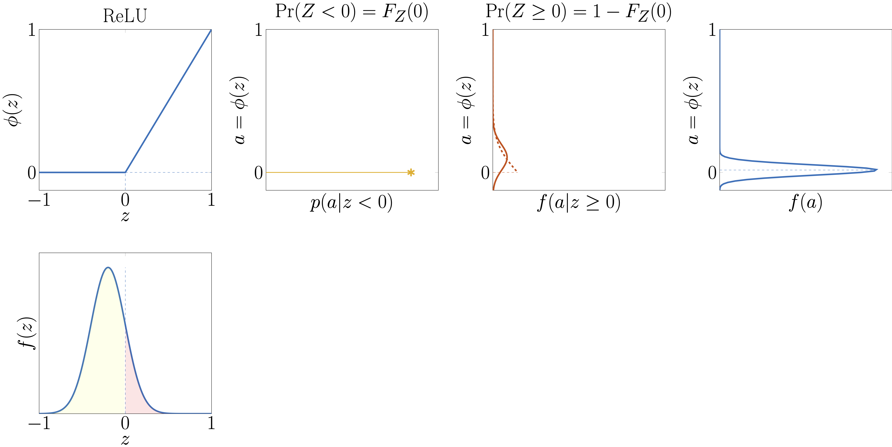
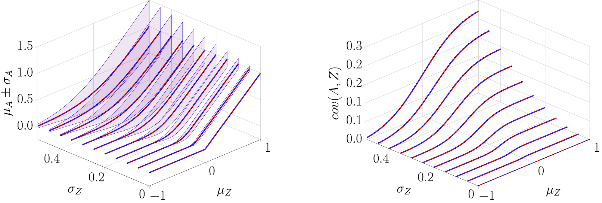
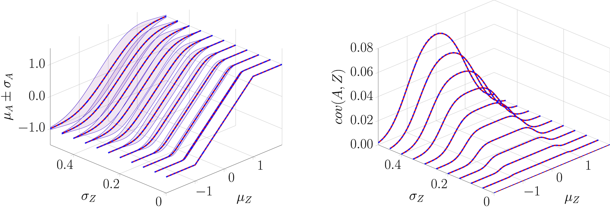

.. _activation:

====================
Activation functions
====================

Exact moment calculations throught analytical expression for piecewise-linear activation functions
--------------------------------------------------------------------------------------------------
For piecewise linear activation functions such as ReLU, we can exactly compute the output moments for a Gaussian input :math:`Z\sim\mathcal{N}(\mu_Z,\sigma_Z^2)`.
As illustrated in the figure below, this can be seen as a mixture of Gaussians where each linear segment is asociated with a probability along with moment associated with a truncated Gaussian.

   Illustration of how an input Gaussian random variable :math:`Z\sim\mathcal{N}(\mu_Z,\sigma_Z^2)` is passed through
   a pieciwise-linear activation function such as ReLU.

The formulations for the analytical expressions for the mixture-based ReLU and Tanh presented below have been derived by Lucas Alric.

Mixture ReLU
~~~~~~~~~~~~
Given a hidden unit :math:`z`, the :func:`pytagi.nn.activation.MixtureReLU` activation function relies
on the following equations where :math:`\Phi(\cdot)` denotes the standard normal
CDF and :math:`\phi(\cdot)` / :math:`\varphi(\cdot)` denote the standard normal PDF:

.. math::

    \begin{aligned}
    a &= \phi_{\mathrm{R}}(z) = \max(0, z)  \\[4pt]
    \mu_A &= \mu_Z \cdot \Phi\!\left(\frac{\mu_Z}{\sigma_Z}\right) + \sigma_Z \cdot \varphi\!\left(\frac{\mu_Z}{\sigma_Z}\right) \\[8pt]
    \sigma_A^2 &= -\mu_A^2 + 2\mu_A \mu_Z
    - \mu_Z \sigma_Z \, \phi\!\left(\frac{\mu_Z}{\sigma_Z}\right)
    + \left(\sigma_Z^2 - \mu_Z^2\right)\Phi\!\left(\frac{\mu_Z}{\sigma_Z}\right) \\[8pt]
    \operatorname{cov}(A,Z) &= \sigma_Z^2 \, \Phi\!\left(\frac{\mu_Z}{\sigma_Z}\right) \\[8pt]
    J &= \frac{\operatorname{cov}(A,Z)}{\sigma_Z^2}
    = \Phi\!\left(\frac{\mu_Z}{\sigma_Z}\right) \\[4pt]
    \operatorname{cov}(A,H) &= \rho_{ZH}\, \sigma_Z \, \sigma_H \,
    \Phi\!\left(\frac{\mu_Z}{\sigma_Z}\right)
    \end{aligned}

   Comparison of the exact **mixtureReLU (red)** output moments :math:`\{\mu_A,\ \sigma_A,\ \operatorname{cov}(A,Z)\}` with the **theoretical values (blue)**
   obtained through MC sampling as a function of :math:`\mu_Z` and :math:`\sigma_Z`.

Mixture Tanh
~~~~~~~~~~~~
Given a hidden unit :math:`z`, the :func:`pytagi.nn.activation.MixtureTanh` activation function simplifies the Tanh function by piecewise linear segments. The formulation relies on the following equations where :math:`\Phi(\cdot)` denotes the standard normal
CDF and :math:`\phi(\cdot)` / :math:`\varphi(\cdot)` denote the standard normal PDF:

.. math::

   \begin{aligned}
   a &= \phi_{\mathrm{T}}(z) = \min(\max(-1, z), 1) \\[4pt]
   \alpha_l &= \frac{1+\mu_Z}{\sigma_Z} \\[4pt]
   \alpha_u &= \frac{1-\mu_Z}{\sigma_Z} \\[8pt]
   \mu_A &= (\mu_Z + 1)\,\Phi(\alpha_l)
   + (\mu_Z - 1)\,\Phi(\alpha_u)
   + \sigma_Z \left( \varphi(\alpha_l) - \varphi(\alpha_u) \right)
   - \mu_Z \\[8pt]
   \sigma_A^2 &= \Phi(\alpha_l)\left(\sigma_Z^2 - \mu_Z^2 - 2\mu_Z - 1\right) \\
   &\quad + \Phi(\alpha_u)\left(\sigma_Z^2 - \mu_Z^2 + 2\mu_Z - 1\right) \\
   &\quad + \sigma_Z\Big(\phi(\alpha_u)(\mu_Z - 1) - \phi(\alpha_l)(\mu_Z + 1)\Big) \\
   &\quad - \mu_A^2 + 2\mu_A \mu_Z + \mu_Z^2 - \sigma_Z^2 + 2 \\[8pt]
   \operatorname{cov}(A,Z) &= \sigma_Z^2 \Big(\Phi(\alpha_u) + \Phi(\alpha_l) - 1\Big) \\[8pt]
   J &= \frac{\operatorname{cov}(A,Z)}{\sigma_Z^2}
   = \Phi(\alpha_u) + \Phi(\alpha_l) - 1
   \end{aligned}

   Comparison of the exact **mixtureTanh (red)** output moments
   :math:`\{\mu_A,\ \sigma_A,\ \operatorname{cov}(A,Z)\}` with the **theoretical values (blue)**
   obtained through MC sampling as a function of :math:`\mu_Z` and :math:`\sigma_Z`.

Mixture Sigmoid
~~~~~~~~~~~~~~~
The :func:`pytagi.nn.activation.MixtureSigmoid` activation function relies on a re-scaling of the ``MixtureTanh()`` activation function such that

.. math::

   a = \phi_{\mathrm{S}}(z) = \frac{\min(\max(-1, z), 1)}{2} + 0.5.

Thus, we can simply divide by a factor of 2 and then add 0.5 the moments obtained from mixtureTanh:

.. math::

   \begin{aligned}
   \mu_A &\leftarrow \tfrac{1}{2}\mu_A + 0.5 \\[6pt]
   \sigma_A^2 &\leftarrow \tfrac{1}{4}\sigma_A^2 \\[6pt]
   J &\leftarrow \tfrac{1}{2} J
   \end{aligned}

.. Exact moment calculations for special cases
   -------------------
   Exponential
   ~~~~~~~~~~~~~~~

Taylor-series expansion (i.e., local linearization)
---------------------------------------------------
When instead of relying on exact moment calculation for an activation function, we instead use the Taylor-series expansion in order to locally linearize it. In that case, the moments are obtained following the generic form

.. math::

   \begin{aligned}
   a &= \phi(z) \\[4pt]
   \mu_A &= \phi(\mu_Z)\\[4pt]
   \sigma_A^2 &= J^2\sigma_Z^2\\[4pt]
   J &= \left.\frac{d \phi(z)}{dz}\right|_{\mu_Z}.
   \end{aligned}
