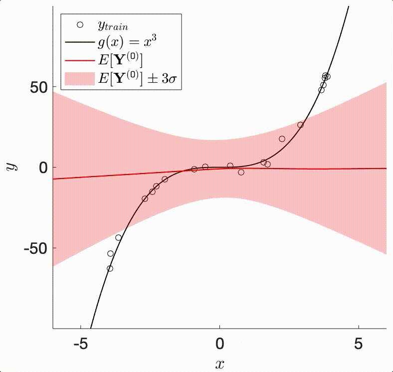
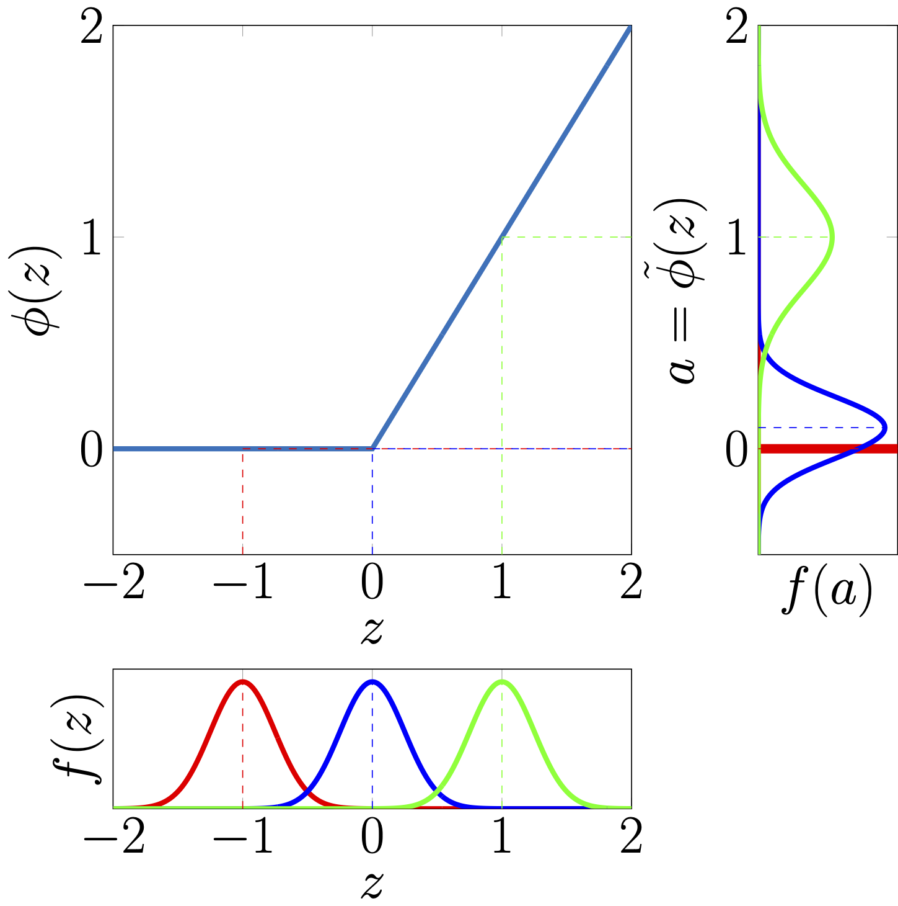
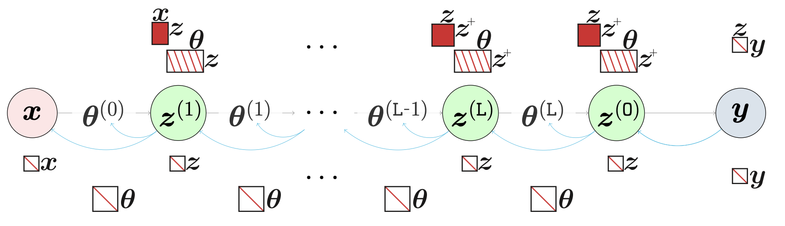

.. _theory:

====================
Theory
====================

The TAGI method enables doing **analytical Bayesian inference in neural networks**. It relies on the assumption that our knowledge of any layer's parameters are modelled by Gaussians. In that context, the Bayesian framework requires defining a Gaussian prior on each parameter, whose posterior expected value will be shifted, and posterior variance reduced through successive updating from training data.

In the simpler linear-Gaussian setup used in classic methods, such as the Kalman filter or Gaussian process regression, it is possible to perform exact Bayesian inference because the model's linear structure preserves the Gaussian nature of its outputs. Moreover, it offers a convenient analytical solution to compute the prior/posterior predictive output moments, as well as the covariance between the outputs and model's parameters. In the case of neural networks, the non-linearities involved do not allow for such exact analytical calculations. In the ``forward()`` calculations TAGI instead relies on either exact or approximated calculations of the predictive output moments and covariances for each layer involved in a given neural network architecture. Despite their large diversity, most neural network layers rely on the same operations, that is the product of a weight parameter with an input value. With TAGI's assumptions that both the layer's input and the weights are Gaussian, we rely on the Gaussian Multiplicative Approcimation (GMA) to provide an exact analytical formulation in order to compute moments, i.e., mean, variance and covariance, for such a product of Gaussians. This serves as the foundational building block for obtaining exact input-output moment calculations for common neural network layers. A second key operation that is common to most neural network architectures involves passing hidden units into non-linear :doc:`activation functions <activation>` . In the case of piece-wise linear functions, such as the ReLU, we have an exact analytical expression for computing the moments of the input-output relationship. For other activation functions where exact expressions are not available, we rely on Taylor-series expansions in order to approximate the moments.

Having access to the predictive expected values and variances of a neural network, along with the covariance between its outputs and parameters, enables using the Gaussian conditional equations in order to perform Bayesian inference in neural networks, like in the case of the Kalman filter or Gaussian process regression. However, a key issue remains; although the exact calculations are feasible, they are also prohibitively expensive because of the large size of the covariance matrices that grow quadratically with respect to the number of hidden units and parameters in each layer. TAGI goes around this tractability challenge by 1) assuming independence a) between all parameters, and between the hidden units within each layer, and 2) by leveraging the conditional independence structure that is built-in common feed-forward neural network architecture. This latter structure allows recursively computing the moments while moving forward from the input to the output of a neural network architecture, without having to store the large covariance matrices that made the exact moment computations intractable. In the pyTAGI library, for each layer, these operations are implemented in the forward calculations, whereas various layers can be combined sequentially in order to form deep architectures. This enables computing analytically either the prior or posterior predictive output values from neural networks.

   Example of input Gaussian distributions being transformed by a ReLU activation function.

In order to perform the Bayesian estimation for learning the parameters or latent variables within a neural network, TAGI relies on the Gaussian conditional equations that are recursively applied backwards from layer to layer, starting from the output. In pyTAGI this forms the ``backward()``, whereas, from a given set of posterior output values for a layer, it computes the posterior for the parameters associated with the layer, as well as the posterior for its input hidden states. pyTAGI is implemented so that the posterior for the hidden states is not explicitly computed nor stored in order to maximize the computational efficiency. This is acheived through computing only the :doc:`delta <delta>` representing only the changes to the parameters or hidden states that are associated with a Gaussian conditional update step.

The TAGI's theory outlined above enables achieving **linear complexity** with respect to the number of parameters in the neural network. Because the complexity is the same as gradient-backpropagation trained neural networks, TAGI has the potential to scale to the same large-scale applications.

Core Theory Papers
-------------------

The core theory behind TAGI is detailed in the following papers:

* `Tractable approximate Gaussian inference for Bayesian neural networks <https://www.jmlr.org/papers/volume22/20-1009/20-1009.pdf>`_ (James-A. Goulet, Luong-Ha Nguyen, and Said Amiri. JMLR, 2021)
* `Analytically tractable hidden-states inference in Bayesian neural networks <https://www.jmlr.org/papers/volume23/21-0758/21-0758.pdf>`_ (Luong-Ha Nguyen and James-A. Goulet. *JMLR*, 2022)

Related Developments
--------------------

Developments related to recurrent architectures and heteroscedastic uncertainty quantification are available in:

* `Coupling LSTM Neural Networks and State-Space Models through Analytically Tractable Inference <https://www.sciencedirect.com/science/article/pii/S0169207024000335>`_ (Van Dai Vuong, Luong-Ha Nguyen and James-A. Goulet. International Journal of Forecasting, 2024)
* `Analytically tractable heteroscedastic uncertainty quantification in Bayesian neural networks for regression tasks <http://profs.polymtl.ca/jagoulet/Site/Papers/Deka_TAGIV_2024_preprint.pdf>`_ (Bhargob Deka, Luong-Ha Nguyen and James-A. Goulet. Neurocomputing, 2024)

Video Tutorials
---------------

Video tutorials are available on:

* `Fundamental TAGI Theory <https://youtu.be/jqd3Bj0q2Sc>`_
* `pyTAGI Backwards <https://youtu.be/OaoxAPNDWmA>`_
* `TAGI-RNN Theory <https://youtu.be/urYuJXzMzrk>`_
* `TAGI Heteroscedastic uncertainty quantification <https://youtu.be/owNPLOBAZMI>`_

.. toctree::
   :maxdepth: 2

   activation
   delta

.. batch
